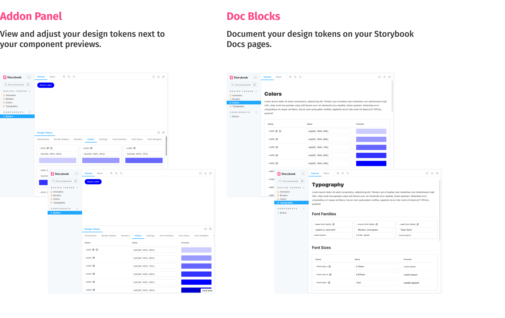

⚠️ **This is the documentation for v1. Please check the "v0"-Branch for the documentation of older versions.** ⚠️

# Storybook Design Token Addon

Display design token documentation generated from your stylesheets and icon files. Preview design token changes in the browser. Add your design tokens to your Storybook Docs pages using the custom Doc Blocks.

**[Show me the demo](https://storybook-design-token-v1.netlify.app/?path=/story/components-button--button)**



**Contents:**

- [Storybook Design Token Addon](#storybook-design-token-addon)
  - [Get started](#get-started)
  - [Available presenters](#available-presenters)
  - [Advanced configuration](#advanced-configuration)
  - [Browser support](#browser-support)

## Get started

First, install the addon.

```sh
$ yarn add --dev storybook-design-token
```

Add the addon to your storybook addon list inside `.storybook/main.js`:

```javascript
module.exports = {
  addons: ['storybook-design-token']
};
```

Next, add the addon configuration to your `.storybook/preview.js` file. The addon works by parsing your stylesheets and svg files (token files) and extracting design token information. Therefore you need to tell the addon where your token files are located. The example below should work for most project setups. It assumes that your token files are located somewhere under a `src` directory, and use the default file extensions (.css, .less, .scss, .svg).

```javascript
const tokenContext = require.context(
  '!!raw-loader!../src',
  true,
  /.\.(css|less|scss|svg)$/
);

const tokenFiles = tokenContext.keys().map(function (filename) {
  return { filename: filename, content: tokenContext(filename).default };
});

export const parameters = {
  designToken: {
    files: tokenFiles
  }
};
```

The last step is to annotate your design tokens with a category name and a presenter. You can do this by adding special comment blocks to your stylesheets. Below is an example of a css stylesheet defining two categories ("Animations" and "Colors"). It works the same way for scss and less files.

```css
:root {
  /**
  * @tokens Animations
  * @presenter Animation
  */

  --animation-rotate: rotate 1.2s infinite cubic-bezier(0.55, 0, 0.1, 1);

  /**
  * @tokens Colors
  * @presenter Color
  */

  --b100: hsl(240, 100%, 90%); /* Token Description Example */
  --b200: hsl(240, 100%, 80%);
  --b300: hsl(240, 100%, 70%);
}
```

The presenter controls how your token previews are rendered. See the next section for a complete list of available presenters. You can omit the presenter definition if you don't want to render a preview or no presenter works with your token.

To list your svg icons, the addon parses your svg files searching for svg elements. **Important: Only svg elements with an `id` or `data-token-name` attribute are added to the token list.**

## Available presenters

Please check the **[demo](https://storybook-design-token-v1.netlify.app/?path=/story/components-button--button)** to see the presenters in action.

- Animation
- Border
- BorderRadius
- Color
- Easing
- FontFamily
- FontSize
- FontWeight
- LineHeight
- Opacity
- Shadow
- Spacing

## Advanced configuration

You can specify the default tab shown in the addon panel. Set it to the corresponsing category name.

```javascript
export const parameters = {
  designToken: {
    defaultTab: 'Colors',
    files: tokenFiles
  }
};
```

To inject styles needed by your design token documentation, use the `styleInjection` parameter. A typical usecase are web fonts needed by your font family tokens. Please note that the styleInjection parameter only works with valid css.

```javascript
export const parameters = {
  designToken: {
    files: tokenFiles,
    styleInjection:
      '@import url("https://fonts.googleapis.com/css2?family=Open+Sans&display=swap");'
  }
};
```

## Browser support

- All modern browsers
- Internet Explorer 11
